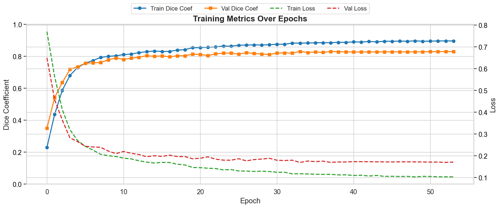
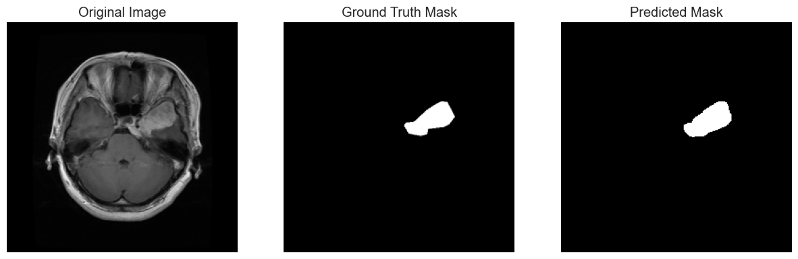

# UNet-MobileNet Segmentation Project

This project implements a UNet model with MobileNet as the encoder backbone for **image segmentation** tasks. The repository includes training, evaluation, visualization, and performance metrics for segmentation datasets.

---

## Features

* UNet architecture with **MobileNet encoder**
* Dice coefficient and Dice loss for training
* Pixel-wise metrics: Dice, IoU, Precision, Recall, F1-score
* Image augmentation: flips, rotations, brightness
* Visualizations:

  * Training metrics (Dice, Loss)
  * Learning rate schedule
  * Model predictions with overlay masks
  * Confusion matrix
* Model checkpointing and CSV logging

---

## Installation

```bash
pip install tensorflow opencv-python matplotlib seaborn scikit-learn pandas tqdm
```

---

## Dataset Structure

Your dataset should be structured as follows:

```
DATASET/
├── images/
│   ├── image1.png
│   ├── image2.png
│   └── ...
└── masks/
    ├── mask1.png
    ├── mask2.png
    └── ...
```

* Images and masks should have the same filename correspondence.

---

## Training

```python
python train_unet_mobilenet.py
```

* Training parameters:

  * Image size: 256x256
  * Batch size: 4
  * Epochs: 200
  * Optimizer: Adam
  * Learning rate schedule with ReduceLROnPlateau
* Callbacks:

  * ModelCheckpoint (save best model)
  * CSVLogger
  * EarlyStopping

*Example Learning Curve:*


---

## Evaluation

```python
python evaluate_predictions.py
```

* Generates predictions for test dataset
* Computes metrics: F1, Jaccard, Precision, Recall
* Saves concatenated results (`Original | Ground Truth | Prediction`) to `results/`
* Generates pixel-wise **confusion matrix** and heatmap

*Example Model Predictions:*


---

## Visualization

* Training metrics: Dice coefficient, loss, learning rate
* Model predictions alongside original images and ground truth masks
* Confusion matrix heatmap

---

## How to Use

1. Prepare your dataset in the required folder structure.
2. Train the model using `train_unet_mobilenet.py`.
3. Evaluate the model using `evaluate_predictions.py`.
4. Visualize results using the provided plotting scripts.

---

## License

This project by @Finova is released under the MIT License.
